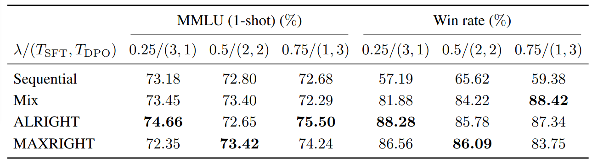

<div align="center">
    
</div>

<hr>

[](https://github.com/hanshen95/SEAL/blob/main/LICENSE) [](https://www.python.org/downloads/release/python-3100/)  [](https://arxiv.org/)


This is the official repo of ALRIGHT and MAXRIGHT algorithms for improved LLM post-training (see the paper [Mitigating Forgetting in LLM Supervised Fine-Tuning and Preference Learning](https://arxiv.org/)).


## Introduction

The widely adopted approach in post-training popular open-source LLMs is to sequentially perform SFT and DPO. However, sequential training is sub-optimal in terms of SFT and DPO trade-off: when trained with preference data, LLM inevitably forgets about the knowledge learnt during SFT, despite the presence of KL regularization. Similar issue persists when performing DPO first and then SFT in LLM continual learning. Simple solution like directly mixing the DPO and SFT objectives greatly increases the computational cost and slows down the training speed.

 As a remedy of these issues, we implement the [ALRIGHT and MAXRIGHT](https://arxiv.org/) algorithms. The algorithms demonstrate the following merits:
 
- **Improved post-training performance**: Models such as [Llama-3-8b](https://huggingface.co/collections/meta-llama/meta-llama-3-66214712577ca38149ebb2b6) trained with ALRIGHT/MAXRIGHT demonstrates superior quality than those trained with sequential method. Experiments showcase a 3% on [MMLU](https://huggingface.co/datasets/cais/mmlu) (1-shot) and a 31% win rate increase on [Anthropic HH](https://huggingface.co/datasets/Anthropic/hh-rlhf).

- **Similar computational cost as sequential training**: The computational cost compared to sequential SFT/DPO is similar, with a worst-case increase of 2% in GPU utilization when training [Llama-3-8b](https://huggingface.co/collections/meta-llama/meta-llama-3-66214712577ca38149ebb2b6).


## Example Results

We give some examples here. For complete results, please see [paper](https://arxiv.org/).

#### Loss space result and computational complexity

Loss trade-off plot for training [Pythia-1b](https://huggingface.co/EleutherAI/pythia-1b) with this implementation (**ALRIGHT and MAXRIGHT**), **sequential** method (SFT then DPO) and **mix**(combining DPO and SFT objectives):

<div align="center">
    
</div>

#### Benchmark result

Result on **Llama-3-8b**. Here $\lambda$ is the normalized weight for DPO loss, defining the trade-off between DPO and SFT:

<div align="center">
    
</div>

The win percent metric follows [AlpacaEval](https://github.com/tatsu-lab/alpaca_eval/tree/main?tab=readme-ov-file), which is commonly used for human preference evaluation.


## Installation

Create conda environment

```bash
conda create -n xright python=3.10
conda activate xright
```

To install xright, navigate to the top-level of the repo and run
```bash
pip install -e .
```

Then, run the following command to install the needed [FlashAttention](https://github.com/Dao-AILab/flash-attention) version
```bash
pip install flash-attn==2.6.1 --no-build-isolation
```

## An Example Implementation

Here we provide example implementations of ALRIGHT and MAXRIGHT, using [Pythia-1b](https://huggingface.co/EleutherAI/pythia-1b) model. First, we need to train the reference policy that will be needed for the DPO objective. This can be trained by

```bash
learning_rate=5e-5
max_len=2048 
train_batch_size=2 # set to no. GPUS used
sft_max_samples=24000 
rlhf_max_samples=8000  
sft_micro_train_batch_size=12  
rlhf_micro_train_batch_size=4  
max_epochs=6
deepspeed --module xright.cli.train_sft_pref\
   --save_path ./checkpoint/pythia-1b-beta=$beta-learning_rate=$learning_rate-epoch=$max_epochs-sft-pref-optim \
   --save_steps -1 \
   --logging_steps 1 \
   --eval_steps -1 \
   --train_batch_size $train_batch_size \
   --pretrain EleutherAI/pythia-1b \
   --bf16 \
   --max_epochs $max_epochs \
   --zero_stage 2 \
   --dataset Dahoas/rm-hh-rlhf \
   --max_samples $sft_max_samples \
   --max_len $max_len \
   --eval_split dummy \
   --rlhf_micro_train_batch_size $(($sft_micro_train_batch_size/2)) \
   --flash_attn \
   --learning_rate $learning_rate \
   --lora_rank 32 \
   --lora_alpha 32 \
   --use_wandb {wandb_token} \
   --target_module query_key_value
```

Next, we can implement ALRIGHT for joint DPO and SFT optimization by running

```bash
beta=0.1
lambd=0.5
learning_rate=5e-5
max_len=2048 
train_batch_size=2 # set to no. GPUS used
sft_max_samples=24000  
rlhf_max_samples=8000  
sft_micro_train_batch_size=12  
rlhf_micro_train_batch_size=4  
max_epochs=6
deepspeed --module xright.cli.train_sft_dpo_alright \
    --save_path ./checkpoint/pythia-1b-beta=$beta-learning_rate=$learning_rate-sft_dpo_alright-temp \
    --save_steps -1 \
    --logging_steps 1 \
    --eval_steps 100 \
    --rlhf_dataset Dahoas/rm-hh-rlhf \
    --train_batch_size $train_batch_size \
    --rlhf_micro_train_batch_size $rlhf_micro_train_batch_size \
    --rlhf_max_samples $rlhf_max_samples \
    --rlhf_max_len $max_len \
    --rlhf_eval_split dummy \
    --sft_dataset vicgalle/alpaca-gpt4 \
    --sft_max_samples $sft_max_samples \
    --sft_max_len $max_len \
    --sft_micro_train_batch_size $sft_micro_train_batch_size \
    --lambd $lambd \
    --pretrain EleutherAI/pythia-1b \
    --ref_pretrain ./checkpoint/pythia-1b-beta=$beta-learning_rate=$learning_rate-epoch=$max_epochs-sft-pref-optim  \
    --bf16 \
    --max_epochs $max_epochs \
    --zero_stage 2 \
    --beta $beta \
    --flash_attn \
    --learning_rate $learning_rate \
    --lora_rank 32 \
    --lora_alpha 32 \
    --use_wandb True \
    --target_module query_key_value
```

Similarly, we can implement MAXRIGHT for joint DPO and SFT optimization by running

```bash
beta=0.1
lambd=0.5
learning_rate=5e-5
max_len=2048 
train_batch_size=2 # set to no. GPUS used
sft_max_samples=24000  
rlhf_max_samples=8000  
sft_micro_train_batch_size=12  
rlhf_micro_train_batch_size=4  
max_epochs=6
max_eval_steps=10 
sft_opt=1.4980
dpo_opt=0.0647
deepspeed --module xright.cli.train_sft_dpo_maxright \
    --save_path ./checkpoint/pythia-1b-beta=$beta-learning_rate=$learning_rate-sft_dpo_maxright-temp \
    --save_steps -1 \
    --logging_steps 1 \
    --eval_steps 100 \
    --rlhf_dataset Dahoas/rm-hh-rlhf \
    --train_batch_size $train_batch_size \
    --rlhf_micro_train_batch_size $rlhf_micro_train_batch_size \
    --rlhf_max_samples $rlhf_max_samples \
    --rlhf_max_len $max_len \
    --rlhf_eval_split dummy \
    --sft_dataset vicgalle/alpaca-gpt4 \
    --sft_max_samples $sft_max_samples \
    --sft_max_len $max_len \
    --sft_micro_train_batch_size $sft_micro_train_batch_size \
    --lambd $lambd \
    --sft_opt $sft_opt \
    --dpo_opt $dpo_opt \
    --ref_pareto_sft "$ref_pareto_sft" \
    --ref_pareto_dpo "$ref_pareto_dpo" \
    --max_eval_steps $max_eval_steps \
    --pretrain EleutherAI/pythia-1b \
    --ref_pretrain ./checkpoint/pythia-1b-beta=$beta-learning_rate=$learning_rate-epoch=$max_epochs-sft-pref-optim  \
    --bf16 \
    --max_epochs $max_epochs \
    --zero_stage 2 \
    --beta $beta \
    --flash_attn \
    --learning_rate $learning_rate \
    --lora_rank 32 \
    --lora_alpha 32 \
    --use_wandb True \
    --target_module query_key_value
```
where `sft_opt, dpo_opt` can be pre-computed by a procedure similar to training a reference policy, or they can be set to `0` if the value is not known.

## Running Experiments

To run experiments given in the paper, run the following commands at the top level of this repo. All the scripts needed to run these commands can be found in the directory `examples/scripts/`.

### Pythia-1b Experiments

For training the optimal SFT and DPO models needed either as reference policies or for optimal SFT and DPO objective value calculation, run
```bash
./run_sft_dpo_optim_pythia1b.sh
```
Then, to train the model sequentially, with SFT first and then DPO, run
```bash
./run_sft_dpo_seq_pythia1b.sh
```
To train the model sequentially, with DPO first and then SFT, run
```bash
./run_dpo_sft_seq_pythia1b.sh
```
To train the joint optimization methods with SFT optimum model as the reference model (corresponding to SFT first then DPO sequential training) run
```bash
./run_moo_sft_ref_training_pythia1b.sh
```

To train the joint optimization methods with the model trained on the chosen responses of the preference dataset as the reference model (corresponding to DPO first then SFT sequential training) run
```bash
./run_moo_pref_ref_training_pythia1b.sh
```

### Llama3-8b Experiments

For training the optimal SFT and DPO models needed either as reference policies or for optimal SFT and DPO objective value calculation, run
```bash
./run_sft_dpo_optim_llama3.sh
```
Then, to train the model sequentially, with SFT first and then DPO, run
```bash
./run_sft_dpo_seq_llama3.sh
```
To train the joint optimization methods with SFT optimum model as the reference model (corresponding to SFT first then DPO sequential training) run
```bash
./run_moo_sft_ref_llama3.sh
```
To generate the inference outputs which will be used to compute the win rates, run
```bash
./run_inference_llama3.sh
```
To compute the win rates compared to the Anthropic-HH test data using [AlpacaEval](https://github.com/tatsu-lab/alpaca_eval), run (make sure you specify a valid OPEN_AI_KEY in the script)
```bash
./run_alpaca_eval_rm_hh_rlhf.sh
```
To evaluate the trained models using MMLU benchmark of [DeepEval](https://github.com/confident-ai/deepeval), run
```bash
./run_MMLU_benchmark.sh
```

## Acknowledgement

We would like to thank all packages this repo is built on, especially

- [OpenRLHF](https://github.com/OpenRLHF/OpenRLHF): for the vanilla SFT and DPO implementation and their great extention capability.
- [DeepSpeed](https://github.com/microsoft/DeepSpeed): for the efficient distributed training functions.


